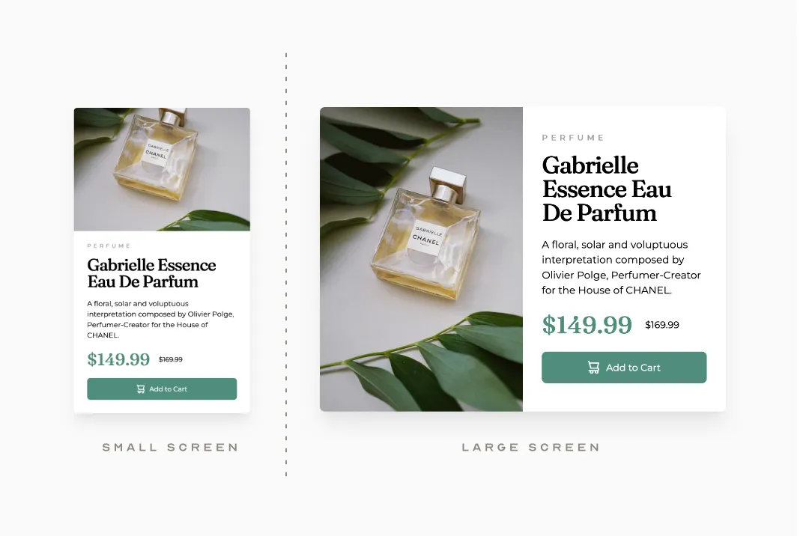

# Frontend Mentor - Product preview card component solution

This is a solution to the [Product preview card component challenge on Frontend Mentor](https://www.frontendmentor.io/challenges/product-preview-card-component-GO7UmttRfa).

## Table of contents

- [Overview](#overview)
  - [The challenge](#the-challenge)
  - [Screenshot](#screenshot)
  - [Links](#links)
- [My process](#my-process)
  - [Built with](#built-with)
  - [What I learned](#what-i-learned)
  - [Continued development](#continued-development)
  - [Useful resources](#useful-resources)
- [Author](#author)
- [Acknowledgments](#acknowledgments)

## Overview

### The challenge

Users should be able to:

- View the optimal layout depending on their device's screen size
- See hover and focus states for interactive elements

### Screenshot



### Links

- Solution URL: [Add solution URL here](https://your-solution-url.com)
- Live Site URL: [Add live site URL here](https://your-live-site-url.com)

## My process

### Built with

- Semantic HTML5 markup
- Tailwind CSS
- Flexbox
- Mobile-first workflow

### Process

This exercise utilises the change of flex direction to handle the different card layouts at varying screen sizes.

## Proposed solution
```html
<div
    class="flex justify-center items-center flex-col md:flex-row max-w-xs md:max-w-lg bg-white rounded-md overflow-clip shadow-xl shadow-neutral-300/50 mt-12 md:mt-24">
    
    
    <div class="text-left flex flex-col px-6 pb-6">
      <span class="uppercase text-[.6em] tracking-[.45em] text-neutral-400 pt-5 pb-3 font-bold">Perfume</span>

      <h1 class="text-3xl font-black tracking-tighter leading-none pr-4">Gabrielle Essence Eau De Parfum</h1>

      <p class="py-4 text-[0.8em]">A floral, solar and voluptuous interpretation composed by Olivier Polge, Perfumer-Creator
        for the House of CHANEL.</p>

      <div class="flex flex-row items-center pb-4 gap-x-4">
        <span class="price text-3xl font-black text-emerald-800/70">$149.99</span>
        <span class="text-xs line-through">$169.99</span>
      </div>

      <button
        class="w-full py-3 bg-emerald-800/70 hover:bg-emerald-700 transition-colors duration-500 focus:ring focus:ring-emerald-700 rounded-md text-white text-xs flex flex-row justify-center gap-x-2">
        
        <span>Add to Cart</span>
      </button>
    </div>
  </div>
```

### Useful resources

- [Tailwind CSS - Flex direction](https://tailwindcss.com/docs/flex-direction)

## Author

- Website - [A Goodreds](https://goodreds.net)
- Frontend Mentor - [@goodreds](https://www.frontendmentor.io/profile/goodreds)
- Twitter - [@goodreds](https://www.twitter.com/goodreds)

## Acknowledgments

n/a
